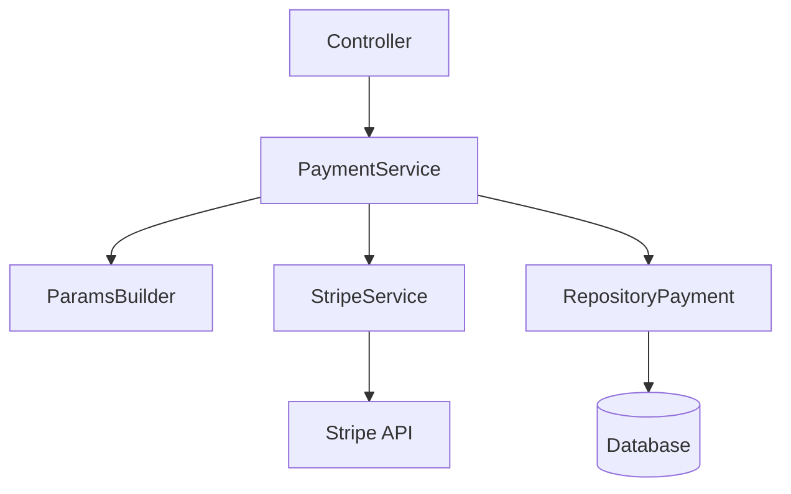

Stripe Payment

API REST desenvolvida com Java e Spring Boot para integração com a Stripe Checkout, permitindo criar sessões de pagamento e consultar pagamentos persistidos localmente.

O projeto tem como objetivo estudar e implementar uma integração de pagamentos, explorando comunicação com uma API externa, persistência de transações, controle de idempotência e tratamento do ciclo de vida de um pagamento.

Tecnologias
Java 17
Spring Boot 3.5.6
Spring Web
Spring Data JPA
Hibernate
PostgreSQL
H2
Stripe Java SDK
Maven
Lombok
Docker
Arquitetura

A aplicação segue uma organização baseada em camadas:

        
Responsabilidades

ProductController

  Responsável por expor os endpoints HTTP da aplicação.

PaymentService

  Contém a regra de negócio para criação e persistência dos pagamentos.

StripeService

  Responsável pela comunicação com a API da Stripe.

ParamsBuilder

  Responsável pela construção dos parâmetros utilizados para criação da Checkout Session.

RepositoryPayment

  Responsável pela persistência dos pagamentos utilizando Spring Data JPA.

Fluxo de criação do pagamento

  O cliente envia uma requisição para:

  POST /product/v1/chekcout

  Exemplo:

  {
    "amount": 1000,
    "name": "Produto exemplo",
    "quantity": 1,
    "correcy": "BRL"
  }

  O fluxo atual é:
  
  Cliente
     │
     │ POST /product/v1/chekcout
     ▼
  ProductController
     │
     ▼
  PaymentService
     │
     ├── verifica idempotência
     │
     ├── cria parâmetros da Checkout Session
     │
     ▼
  StripeService
     │
     ▼
  Stripe API
     │
     └── Checkout Session
     │
     ▼
  PaymentService
     │
     └── persiste Payment
     │
     ▼
  Cliente
  
Integração com Stripe

A integração utiliza o Stripe Java SDK.

A chave secreta é configurada através da propriedade:

stripe.secretKey=${STRIPE_SECRET_KEY}

A configuração da API é realizada no StripeConfig, que inicializa a chave da Stripe durante a inicialização da aplicação.

A criação da Checkout Session utiliza:

moeda;
valor unitário;
nome do produto;
quantidade;
modo PAYMENT;
URL de sucesso;
URL de cancelamento.
Checkout Session

O ParamsBuilder transforma os dados recebidos pela API em um objeto SessionCreateParams.

A sessão criada pela Stripe fornece informações como:

sessionId;
sessionUrl;
paymentIntentId.

Essas informações são utilizadas para manter uma referência entre o pagamento local e a operação realizada na Stripe.

Idempotência

A integração utiliza uma Idempotency Key na comunicação com a Stripe.

A chave é enviada através de RequestOptions:

''' mermaid
Request
   │
   ▼
PaymentService
   │
   ├── gera idempotency key
   │
   ├── verifica pagamento existente
   │
   ▼
StripeService
   │
   └── RequestOptions
          │
          └── Idempotency-Key '''

O objetivo da idempotência é evitar que uma mesma operação gere múltiplas operações de pagamento quando uma requisição é repetida.

A implementação atual ainda pode ser aprimorada para que a chave de idempotência seja fornecida pelo cliente e tenha uma relação mais determinística com a operação.

Persistência

A entidade Payment representa o pagamento armazenado localmente.

Principais informações:

Campo	Responsabilidade
id	Identificador interno
sessionId	ID da Checkout Session da Stripe
sessionUrl	URL da Checkout Session
paymentIntentId	Identificador do PaymentIntent
amount	Valor do pagamento
name	Nome do produto
quantity	Quantidade
correcy	Moeda
status	Estado do pagamento
idepotency	Chave de idempotência

Os estados atualmente definidos são:

PENDENTE
APROVADO
RECUSADO
Endpoints
Criar Checkout Session
POST /product/v1/chekcout

Responsável por criar uma sessão de pagamento na Stripe.

Consultar pagamento
GET /product/v1/{id}

Retorna o pagamento persistido pelo identificador interno.

Exemplo:

GET /product/v1/1
Webhook
Status atual

Em desenvolvimento.

O projeto já possui uma estrutura inicial para receber eventos da Stripe através do endpoint:

POST /wenbhook/stripe

A intenção é utilizar eventos da Stripe para atualizar o estado do pagamento local, por exemplo:

Stripe
   │
   │ payment_intent.succeeded
   ▼
Webhook
   │
   ▼
Payment
   │
   └── APROVADO

e:

Stripe
   │
   │ payment_intent.payment_failed
   ▼
Webhook
   │
   ▼
Payment
   │
   └── RECUSADO

Entretanto, essa funcionalidade ainda não está concluída e não deve ser considerada parte funcional da aplicação neste momento.
